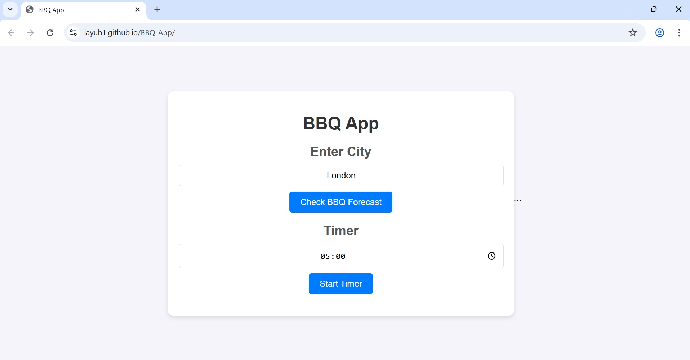
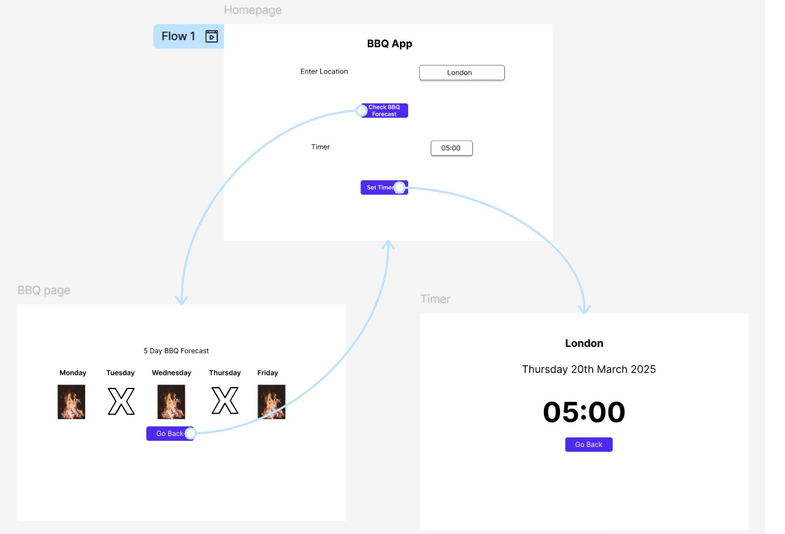
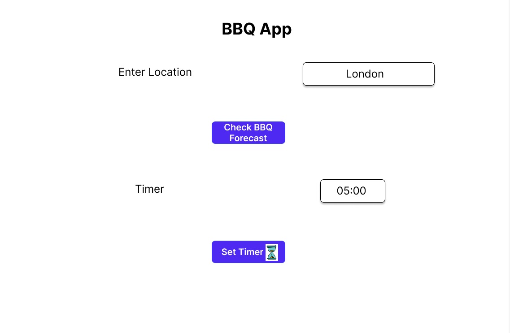
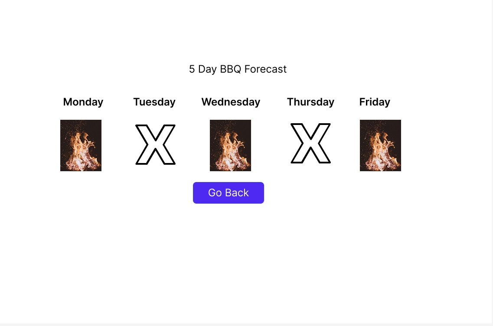
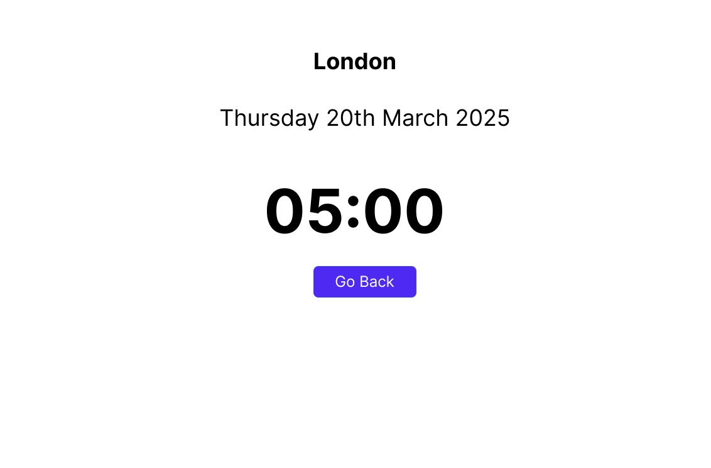
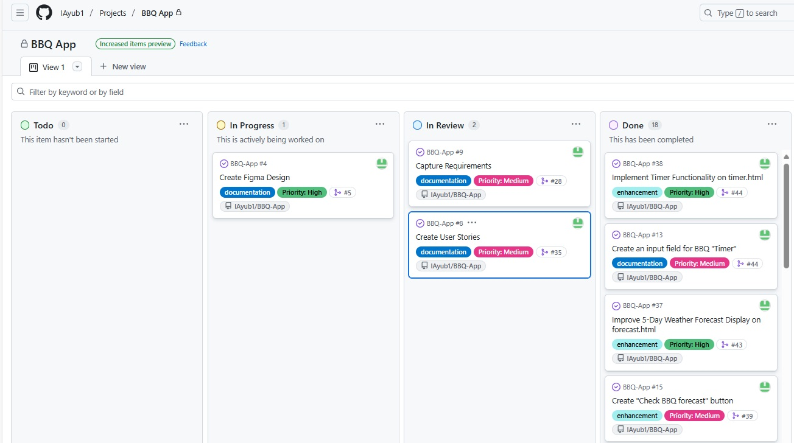
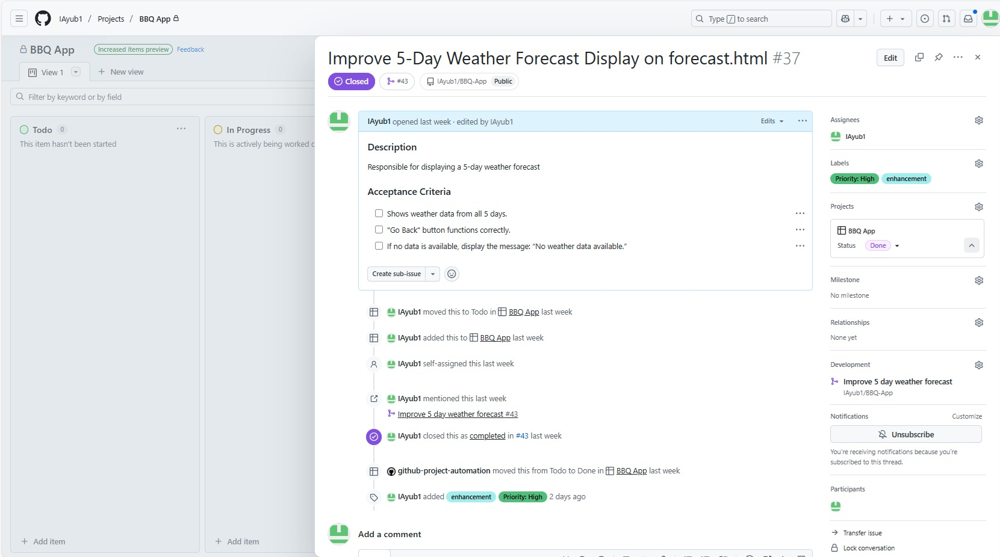
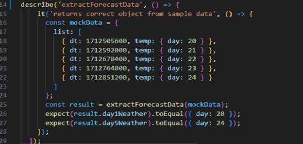
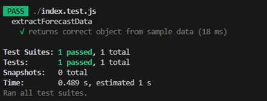
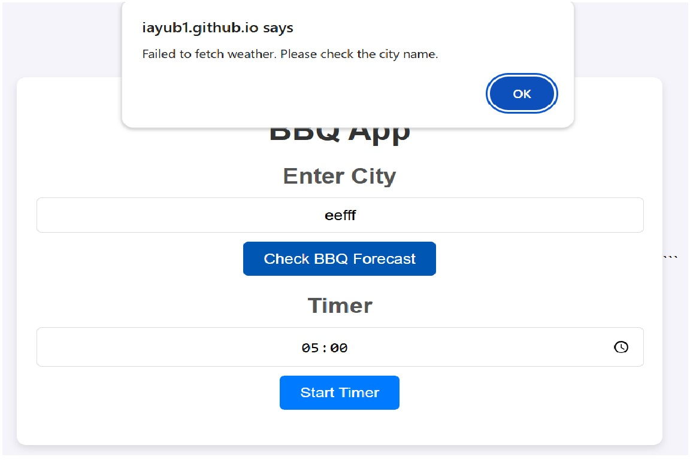

# BBQ Application

## Introduction

The purpose of this project is to focus on developing a user-friendly weather forecast application designed to help users plan their BBQs based on weather forecast information. The app will display a 5-day forecast in a simple and visually clear layout, helping users make better decisions about outdoor BBQ's.

## About

[Live app](https://iayub1.github.io/BBQ-App/)

Author: Ismael Ayub

Github Username: @IAyub1

### User Guide

**Step 1: Enter City**
- Click on the input box under "Enter City".
- Type the name of your city (e.g., london).

**Step 2: Check BBQ Forecast**
- Click the "Check BBQ Forecast" button.
- The app will fetch and display the latest 5-day weather forecast for your selected city.

**Step 3: Set Timer**
- Under the "Timer" section, click the timer field.
- Set your desired countdown time for your BBQ session.

**Step 4: Start Timer**
- Once you’ve set the time, click the "Start Timer" button.
- The app will start counting down and alert you when the time is up!

The image displays the BBQ App web interface, where users can enter a city to check the BBQ weather forecast and use a built-in timer feature for their BBQ sessions.

## Technical Documentation 

1. Tools and Technologies used
 - Javascript
 - Jest
 - HTML 
 - CSS

2. User links
 - Repo name: BBQ App
 - Figma link: https://www.figma.com/design/gCQJYq2dC6efLv0Lx3SHWF/Untitled?node-id=0-1&p=f&t=4SlC1dBnChMY3HeO-0
 - Repo link: https://iayub1.github.io/BBQ-App/
 - Weather data API link: https://openweathermap.org/forecast5

 3. Files used to run the app
 - index.js
 - index.css
 - index.html

 4. Files used for testing 
 - index.js
 - index.test.js
 - package.json

 

## Project Requirements

User Interface

- Search bar for input location
- Display possible BBQ days
- Display Dates and select location
- User can set timer

Data

- Temperature weather forecast data through OpenWeatherMap API 

Error handling

- If cannot connect to API display error message
- If inputted a non existant city name, display error message

Validation

- Ensure valid city names have been input in search bar

## User Stories

User stories are short, simple descriptions of a feature from the perspective of the person who needs it. They help people involved understand what users want and why it matters, keeping the focus on real human needs.

### **User Story 1: Ability to view location**

Given I'm a user

When I search for a location 

Then the app should display the current location I am in.

### **User Story 2: Input a time**

Given I'm a user

When I want to select a time for my BBQ

Then the app will take me to a page 

So that I can view the timer

User Story 3: View 5 day BBQ forecast they inputted

Given I'm a user

When I click on "Get Forecast"

Then i can see a 5-day weather forecast for that location

### **User Story 4: View the timer countdown amd make a sound when it reaches 0** 

Given I'm a user

When I have set a countdown timer for my BBQ 

And the timer reaches zero

Then the app should play a sound to notify me  

## Design and Prototyping 

**Wireframes**

[Link to Figma](https://www.figma.com/design/gCQJYq2dC6efLv0Lx3SHWF/Untitled?node-id=0-1&p=f&t=4SlC1dBnChMY3HeO-0)

Below is the screenshot of the connected figma prototype

Below are individual mockup screens designed in Figma

The flow starts with the Homepage, where the user can enter their location in the text box (for example, "London") and either:

- Click "Check BBQ Forecast" to see if the weather is good for a BBQ, or
- Set a countdown using the "Set Timer" button.

From the homepage, if the user clicks "Check BBQ Forecast", they are taken to the BBQ Page. Here, the app displays the 5-day BBQ forecast, showing icons for each day a flame icon for good BBQ days, and an X for bad weather days. There is also a "Go Back" button that takes the user back to the homepage.

Alternatively, if the user selects "Set Timer", they are directed to the Timer Page. This page shows the location, the current date, and the countdown timer that was set on the homepage. Just like the BBQ page, there is a "Go Back" button here to return to the homepage.

The arrows in the flow diagram represent the direction the user moves between the pages, making it easy to understand how navigation works within the app.

When designing the app, I made sure to consider accessibility to create an inclusive experience for all users. I used large, clear text and distinct button colours to improve visibility and make navigation easier, especially for users with visual impairments. The buttons are also well sized to support users who may have difficulties, ensuring they can interact with the app comfortably. For the timer feature, I added an audible alert that plays when the timer ends, providing an additional sensory cue for users who may not be constantly looking at the screen. These design choices help make the app more user-friendly and accessible to a wider range of users.

## Project Management Tools

To manage the project efficiently, I implemented GitHub Projects as my primary project management tool. Managing the Kanban methodology, I created a clear and visual workflow that helped maintain focus and organisation throughout development. 

To efficiently oversee the project, I adopted the Kanban approach within GitHub Projects. This visual framework, organized into columns such as 'Backlog,' 'Ready,' 'In Progress,' 'In Review,' and 'Done,' offered a clear and dynamic view of the project's progress. By actively moving tasks through these stages, I kept a close eye on workload distribution, monitored development milestones, and ensured timely delivery. Additionally, I linked each task to its corresponding Git branch, creating seamless integration between project tracking and code development, while maintaining full traceability throughout the process.

**Example issue**

The task shows the improvement of the 5-day weather forecast data, which includes clear acceptance criteria and is linked directly to the corresponding development branch. The task moved through the workflow from 'To Do' to 'Done,' with updates and status changes automatically reflected, providing full visibility of progress and completion.

The labels in this task "Priority: High" and "enhancement" help categorise and prioritise the work. High priority indicates that this task was urgent and needed to be completed promptly, while enhancement shows that the work involved improving an existing feature

## MVP Development

After finalising the app design and capturing the requirements, the MVP of the BBQ App was developed to meet all the key functionalities as planned. The app successfully included all the essential features and aligned with the initial designs created during the planning stage.

The first step in developing the MVP was to build the core HTML structure. This involved creating the homepage (index.html), where users can enter their location, set a timer, and navigate through the main functions of the app. "<*title*> tags were used to set meaningful page titles, helping with clarity and accessibility. The <*link*> element connected the HTML files to the CSS stylesheet, which styled the overall layout, made the interface clean, and ensured consistency across the pages. The initial CSS work focused on visuals, spacing, and button styling, making the app visually clear and user-friendly.

Next, the specific HTML files were created for the different app functionalities. The forecast.html page was developed to display the 5-day BBQ forecast, using visual icons to show BBQ-suitable days. The timer.html page was built to show the countdown timer, displaying the user’s chosen location, current date, and the timer itself. Accessibility considerations were applied throughout using large text, high-contrast button colours, and properly structured layouts to make the app easy to navigate for all users.

To enhance the user experience, the buttons were styled using CSS, ensuring they were visually distinct and easy to click. For accessibility, an audible alert was added to the timer feature, allowing users to be notified when their BBQ timer ends, even if they aren’t actively watching the screen. These design choices contributed to making the app not only functional but also accessible and inclusive.

Finally, JavaScript was used to power the app’s functionality. Scripts handled retrieving weather data, managing the countdown timer and enabling smooth page navigation. The <*script*> tag was used to link the HTML to the JavaScript files, ensuring interactive elements responded to user actions. Overall, the combination of HTML, CSS, and JavaScript allowed the BBQ App MVP to deliver a complete, interactive experience.

## Test driven dvelopment (TDD) 

Throughout the development process, I adopted a test first approach by writing unit tests using Jest, which are recorded in the index.test.js file. Jest, known for its fast execution and easy configuration, allowed me to  test the app’s logic functions. Writing tests early in development enabled me to catch and resolve potential issues quickly, which significantly improved the stability and dependability of the app. 

**Example test**
#

**Test passed**

### **Manual Test**

Manual testing was carried out to ensure the app responded correctly to invalid user input. When random or incorrect text was entered into the location field, such as a string of letters with no valid meaning, the app successfully displayed an error message alerting the user to check the city name. This confirmed that both the input validation and error handling functions were working as intended. The test verified that the application can gracefully handle incorrect data input, enhancing the user experience by providing clear feedback and preventing the app from failing silently.

## Evaluation

The development of the BBQ App met all the core requirements, including the provision of accurate 5-day weather forecasts and the integration of a user-friendly countdown timer for BBQ sessions. The app features clear navigation between pages, an accessible interface with large text and distinct button colours, and an audible timer alert to notify users when the countdown concludes. A significant challenge during development involved integrating the weather API and managing errors effectively. This was addressed through thorough testing and debugging, with particular attention to handling invalid city inputs, resulting in reliable feedback for the user.

When the app was tested by users, feedback was overwhelmingly positive. Users appreciated the simplicity of the design and found the app intuitive to use. They highlighted that the visual forecast made it easy to plan BBQ days, and the timer feature was practical for managing cooking times. However, some users suggested improvements to input validation, as currently, the app allows any text input for the city field, which can cause errors if the input does not match a valid location. For future iterations, enhanced validation will be implemented to guide users towards entering valid city names. Additionally, planned improvements include providing suggestions or auto-complete for city entries to further improve usability, and potentially integrating more detailed weather data, such as temperature and wind speed, to give users an intuitive experience.